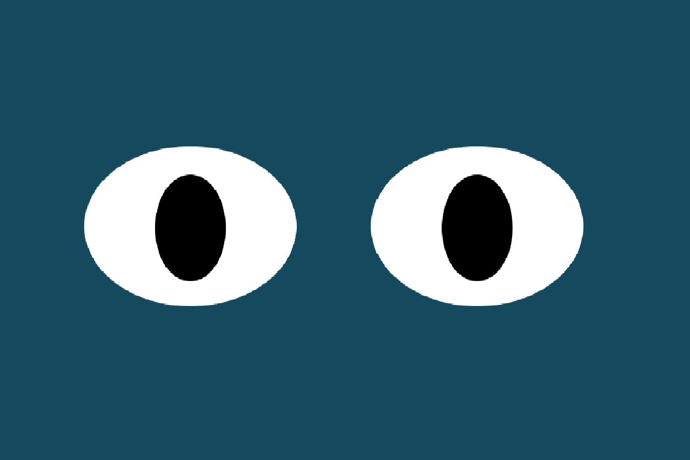

# Eyes Exercise
## For this exercise the goal was to create a set of eyes that follow the movement of the mouse on screen.
# How to Run
## To run through this exercise please fork the files to you local machine.  Once you have the HTML, JS, and CSS files in VS you can drag the HTML file to your browser window and drag your mouse around the screen while the eyes follow.
# Future Improvements
## Some further imporvements I would like to add to this project would be some click to blink features.  I also think it would be interesting if the user could add customize the page a bit, for example add a pair of sunglasses, eyelashes, eyebrows etc.
# License
## Please refer to the "MIT License.txt" file in repo for licensing information.
 
